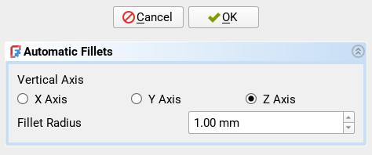

## Command: Auto Fillet
This command automatically adds a fillet to all vertical edges of a part.  Such
fillets allow the printer to move faster and with less vibration because it
does not have to stop for sharp corners.  See this demonstration of the common
speed changes (notice the dark blue sharp corners):

This command will apply a fillet to _all_ edges that are more vertical than 45°
on the active body.  This is mainly useful for simple designs where selecting
all those edges manually would be quite tedious.

## Prerequisites
- A PartDesign body must be active.

## Usage
Run this command to automatically generate a fillet feature for all the vertical edges of a part.

A dialog will open in the [Task Panel][task-panel] where you can
control the generation.

- **Vertical Axis**: Which axis of the body corresponds to the "vertical" axis
  of your printer.  This is the axis that will be used for checking which edges
  are vertical.

- **Fillet Radius**: The radius of the fillets to be created.

Click "OK" to generate the fillets.

[task-panel]: https://wiki.freecad.org/Task_panel
