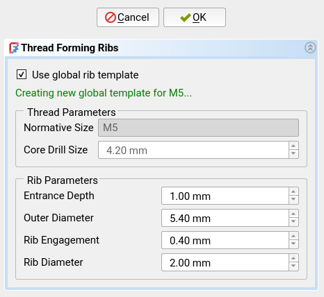

## Command: Thread Forming Ribs
This command is primarily accessed through the [Hole Wizard](./ffDesign_HoleWizard.md).

This command adds ribs to a Hole that will be formed into a thread when a screw is screwed in.

If you want to learn more about this design technique, read [Rib Thread
Forming][df3dp-rib-threads] from my [Design for 3D-Printing][df3dp]
guide.  Or watch the great video about this topic by [Thomas Sanladerer][yt-rib-threads].

## Prerequisites
- A [PartDesign Hole][pd-hole] feature must be selected or the tip of the
  active body must be a [PartDesign Hole][pd-hole].
- The Hole must use a standard thread size.
- The Hole must be threaded.

## Usage
Run this command to generate the thread forming ribs.  A dialog will open in
the [Task Panel][task-panel] where you can control the generation.

For popular thread sizes, FusedFilamentDesign already provides proven values
for the parameters.  You will see this because the values are automatically
filled in.  For other thread sizes, you have to supply your own parameters.
Feel free to contribute more values to this addon (here is the [Table of
Default Parameters][rt-table-code]).

- **Use global rib template**:  This option controls whether the rib template
  will be _global_ (one template for the entire document) or _local_ (template
  is only used for this particular Hole feature).

  The global templates are shared for all Holes with the same thread size (e.g.
  all M5 holes).

  If an existing template is found (global or local, as selected), it will be
  reused.  In this case, it is not possible to adjust the rib parameters.  The
  green message text below the checkbox tells you what option is chosen.

- Thread / **Normative Size**: Informational only, this displays the thread size from
  the selected Hole feature.

- Thread / **Core Drill Size**: This is the drill size used to drill a hole for tapping
  a thread of this size.  In most situations, this is automatically derived and
  you do not have to adjust it.

- Rib / **Entrance Depth**: Depth of the entrance, before the ribs start tapering in.
  The ribs currently have a fixed taper angle of 20°.

- Rib / **Outer Diameter**: The diameter of the clearance hole for this thread size.

- Rib / **Rib Engagement**: How much the ribs should protrude into the thread
  of the screw.  Too little will lead to very weak threads.  Too much will
  increase the torque needed to insert the screw.  A good compromise seems to
  be to leave a slight clearance to the core size of the screw.

- Rib / **Rib Diameter**: Diameter of the semi-circle of each rib.  Controls,
  how "fat" each rib is.

The rib parameters can only be adjusted when no pre-existing template is found.
If a template is found, its parameters are displayed for informational
purposes.

Click "OK" to then proceed generating the thread forming ribs.  This will
create the following features:

- The global or local template, if it does not exist yet.
- A [VarSet][varset] with a few additional parameters for adjustment, see below.
- Shape-binders of the template placed on each hole of the Hole feature.
- Possibly a merged shape-binder that combines all of the previous ones.
- A pocket for the ribs.
- A second pocket for the entrance into each hole.

After generation, you can adjust the rotation of the ribs in the holes via the
VarSet.  It has a `Rotation` property for this purpose.  Adjusting the rotation
may be necessary to orient the ribs in a horizontal hole such that no ribs
hangs unsupported from the top of the hole.

## Parametricity
This feature is parametric with respect to the following variables:

- Hole
  * The depth type of the hole ("Dimension" vs "Through all") (`DepthType` property)
  * The depth of the hole (`Depth` property)
- Supporting Sketch
  * The position of the circles in the supporting sketch of the original Hole feature.
  * The position of the supporting sketch itself.
- Thread Forming Rib VarSet
  * Rotation of the ribs in each hole.
  * Entrance depth of the thread forming ribs.

This feature is **not** parametric with respect to the following variables.
You will need to delete the feature and recreate it to update these variables:

- Hole
  * Thread size of the Hole.
- Supporting Sketch
  * The number of circles in the supporting sketch of the original Hole feature.

[pd-hole]: https://wiki.freecad.org/PartDesign_Hole
[df3dp]: https://blog.rahix.de/design-for-3d-printing/
[df3dp-rib-threads]: https://blog.rahix.de/design-for-3d-printing/#rib-thread-forming
[yt-rib-threads]: https://www.youtube.com/watch?v=HgEEtk85rAY
[task-panel]: https://wiki.freecad.org/Task_panel
[rt-table-code]: https://github.com/Rahix/FusedFilamentDesign/blob/main/ffDesign_RibThreads.py#L29-L52
[varset]: https://wiki.freecad.org/Std_VarSet
