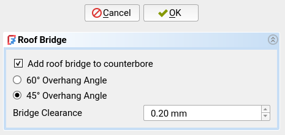

## Command: Roof Bridge
This command is primarily accessed through the [Hole Wizard](./ffDesign_HoleWizard.md).

This command generates a flat bridge at the top of a Hole to avoid steep
overhangs that are hard to print well.  On the image below, the right hole has
a roof bridge.

If you want to learn more about this design technique, read [Horizontal
Holes][df3dp-horz-holes] from my [Design for 3D-Printing][df3dp]
guide.

## Prerequisites
- A [PartDesign Hole][pd-hole] feature must be selected or the tip of the
  active body must be a [PartDesign Hole][pd-hole].

## Usage
Run this command to generate a roof bridge for the selected Hole feature.  A
dialog will open in the [Task Panel][task-panel] where you can control the
generation.

- **Add roof bridge to counterbore**: If the selected Hole has a counterbore,
  you can also add a roof bridge to the counterbored section.

- **Overhang Angle**: The maximum overhang angle to allow.  This will influence
  the width of the bridge.

- **Bridge Clearance**: How much clearance to leave below the bridge to the
  theoretical top of the Hole's circle.  This clearance needs to be added to
  account for the slight drooping of the printed bridges.  Defaults to 0.2 mm.

Click "OK" to then proceed generating the roof bridges.  This will
create the following features:

- A pocket for the roof bridges of all holes in this Hole feature.
- Possibly a second pocket for the roof bridges of the counterbored sections.

Additionally, three properties will be added to the original Hole feature which
can be used to parametrically control the roof bridges:

- `RoofBridgeClearance` is the aforementioned bridge clearance.
- `RoofBridgeOverhang` is the aforementioned maximum overhang angle.
- `RoofBridgeRotation` is the orientation of the roof bridges.  Use this to
  reorient the roof bridges in the right direction for the print orientation of
  your part.

## Parametricity
This feature is parametric with respect to the following variables:

- Hole
  * The depth type of the hole ("Dimension" vs "Through all") (`DepthType` property)
  * The depth of the hole (`Depth` property)
  * Potentially the size and depth of the counterbore (`HoleCutDepth` and `HoleCutDiameter` properties)
- Supporting Sketch
  * The position of the circles in the supporting sketch of the original Hole feature.
  * The position of the supporting sketch itself.
- Roof Bridge Properties of the Hole
  * Bridge clearance (`RoofBridgeClearance` property)
  * Maximum overhang angle (`RoofBridgeOverhang` property)
  * Orientation of the roof bridges (`RoofBridgeRotation` property)

This feature is **not** parametric with respect to the following variables.
You will need to delete the feature and recreate it to update these variables:

- Hole
  * Adding or removing a counterbore.
- Supporting Sketch
  * The number of circles in the supporting sketch of the original Hole feature.

[pd-hole]: https://wiki.freecad.org/PartDesign_Hole
[df3dp]: https://blog.rahix.de/design-for-3d-printing/
[df3dp-horz-holes]: https://blog.rahix.de/design-for-3d-printing/#horizontal-holes
[task-panel]: https://wiki.freecad.org/Task_panel
