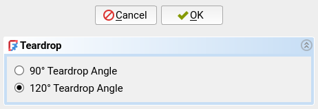

## Command: Teardrop Shape
This command is primarily accessed through the [Hole Wizard](./ffDesign_HoleWizard.md).

This command makes circular holes into teardrop shapes.  This is useful for two
purposes:

1. On horizontal holes, to avoid steep overhangs that are hard to print well.
   On the image below, the left hole has a teardrop shape (and the right one
   has a [Roof Bridge][roof-bridge]).

   

2. On vertical holes, to avoid inaccuracies caused by the perimeter seam.  On
   the image below, you can see how the seam is placed into the corner of the
   teardrop.

   

If you want to learn more about these design techniques, read [Horizontal
Holes][df3dp-horz-holes] and [Seemingly Seamless][df3dp-seams] from my [Design for 3D-Printing][df3dp]
guide.

## Prerequisites
- A [PartDesign Hole][pd-hole] feature must be selected or the tip of the
  active body must be a [PartDesign Hole][pd-hole].

## Usage
Run this command to generate teardrop shapes for the selected Hole feature.  A
dialog will open in the [Task Panel][task-panel] where you can control the
generation.

- **Teardrop Angle**: The acute angle at the top of the teardrop.

Click "OK" to then proceed generating the teardrop shapes.  This will
create the following features:

- A pocket for the teardrop shapes of all holes in this Hole feature.

Additionally, two properties will be added to the original Hole feature which
can be used to parametrically control the teardrops:

- `TeardropAngle` is the aforementioned teardrop angle.
- `TeardropRotation` is the orientation of the teardrops.  Use this to
  reorient the teardrops in the right direction for the print orientation of
  your part.

## Parametricity
This feature is parametric with respect to the following variables:

- Hole
  * The depth type of the hole ("Dimension" vs "Through all") (`DepthType` property)
  * The depth of the hole (`Depth` property)
- Supporting Sketch
  * The position of the circles in the supporting sketch of the original Hole feature.
  * The position of the supporting sketch itself.
- Teardrop Properties of the Hole
  * Teardrop Angle (`TeardropAngle` property)
  * Orientation of the teardrops (`TeardropRotation` property)

This feature is **not** parametric with respect to the following variables.
You will need to delete the feature and recreate it to update these variables:

- Supporting Sketch
  * The number of circles in the supporting sketch of the original Hole feature.

[pd-hole]: https://wiki.freecad.org/PartDesign_Hole
[df3dp]: https://blog.rahix.de/design-for-3d-printing/
[df3dp-horz-holes]: https://blog.rahix.de/design-for-3d-printing/#horizontal-holes
[task-panel]: https://wiki.freecad.org/Task_panel
[roof-bridge]: ./ffDesign_RoofBridge.md
[df3dp-seams]: https://blog.rahix.de/design-for-3d-printing/#seemingly-seamless
