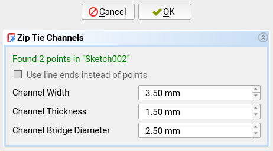

## Command: Zip Tie Channels
This command is a convenient tool to generate channels for zip ties to a part.
This provides an easy way to fasten cables and other things to your designs.

If you want to learn more about this design technique, read [Zip Tie
Channels][df3dp-zip-ties] from my [Design for 3D-Printing][df3dp]
guide.  Or watch the great video by [Alan Reiner][yt-zipties].

## Prerequisites
- A sketch in the current active body must be selected.

## Usage
Run this command to generate zip tie channels for each point in the selected
sketch.

**Important**: The sketch must contain acutal [Point][sketch-point] features!
Right now, this tool will ignore other "points" like the ends of lines or the
center of circles.

A dialog will open in the [Task Panel][task-panel] where you can
control the generation.

- **Use line ends instead of points**: Not yet supported.

- **Channel Width**: Width of the zip tie channels.  Should be the width of
  your zip ties plus some clearance.

- **Channel Thickness**: Thickness of the zip tie channels, or height of the
  zip ties.  Should leave plenty of clearance, because otherwise the inserting
  the zip ties becomes really really difficult.

- **Channel Bridge Diameter**: Diameter of the inner bridge, spanning across
  the zip tie channel.  This diameter significantly impacts the strength of the
  zip tie channels.
 
Click "OK" to then proceed generating the zip tie channels.  This will
create the following features:

- A template sketch for the zip tie channel shape.
- A [VarSet][varset] with various parametric settings for the channels.
- A shape-binder and a pocket feature for each zip tie channel.

In the generated VarSet, you can additionally control the orientation of the
zip tie channels.  It contains a `ChannelRotation` property for this purpose.

The orientation is important, because zip tie channels where the layer lines do
not run across the channel bridge are very fragile.

## Parametricity
This feature is parametric with respect to the following variables:

- Supporting Sketch
  * The position of the points in the supporting sketch
  * The position of the supporting sketch itself
- Zip Tie Channel Template
  * The dimensions constrained in the template sketch.
- Zip Tie Channel VarSet
  * The width of the zip tie channels (`ChannelWidth` property)
  * The orientation of te zip tie channels (`ChannelRotation` property)

This feature is **not** parametric with respect to the following variables.
You will need to delete the feature and recreate it to update these variables:

- Supporting Sketch
  * The number of points in the supporting sketch

[pd-hole]: https://wiki.freecad.org/PartDesign_Hole
[df3dp]: https://blog.rahix.de/design-for-3d-printing/
[df3dp-zip-ties]: https://blog.rahix.de/design-for-3d-printing/#zip-tie-channels
[yt-zipties]: https://www.youtube.com/watch?v=qgt9P6jsyaY
[task-panel]: https://wiki.freecad.org/Task_panel
[sketch-point]: https://wiki.freecad.org/Sketcher_CreatePoint
[varset]: https://wiki.freecad.org/Std_VarSet
