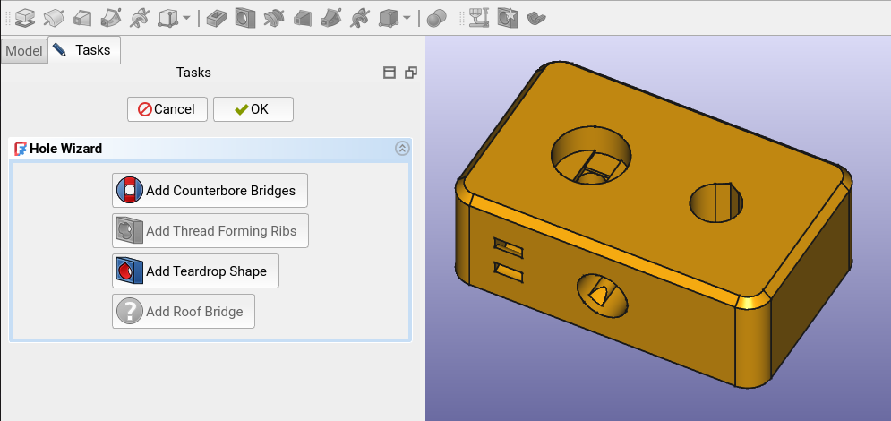

_FusedFilamentDesign_ Addon for FreeCAD
---------------------------------------
This is a [FreeCAD PartDesign][fc-partdesign] addon for FFF/FDM 3D-printing design.  It includes various tools to generate geometry for better printability of a part.

## Usage
The addon adds a new toolbar to the [PartDesign][fc-partdesign] workbench where
the new tools can be accessed.  Check the tooltips for some preliminary usage
documentation.

## Status
This addon is still work in progress.  Only a few of the features listed below
are already implemented.  The ones that are already available can be used
without worries.

## Features
-  **Hole Wizard** — Various tools for enhancing [PartDesign Hole][fc-hole] features
  *  Implementation of the [overhanging counterbore trick][df3dp-counterbore] (**R3.5**)
  *  Hole geometry for [rib thread forming][df3dp-ribthreads] (**R5.4**)
  *  Teardrop-shaped holes for [better horizontal holes][df3dp-horizontal-holes] and to avoid [seam inaccuracy][df3dp-seam] (**R2.2** & **R2.3**)
  * _Planned:_ Roof bridges for [horizontal holes][df3dp-horizontal-holes] (**R2.2**)
- _Planned:_ **Zip Tie Channels** — Generate parametric [zip tie channels][df3dp-zip-ties] on a part's surface (**R4.1**)
- _Planned:_ **Seam Groove** — Generate a seam groove to control [where the slicer will place the perimeter seams][df3dp-seam] (**R2.3**)
- _Planned:_ **Sacrificial Layer** — Generate a [sacrificial layers][df3dp-sacrificial] for some surface with holes (**R3.4**)

(The **R#.#** numbers reference the rules from my [Design for 3D-Printing][df3dp-main] guide)

## License
This addon is licensed under the `LGPL-2.1-or-later` license.  See [LICENSE](./LICENSE) for more info.

[fc-partdesign]: https://wiki.freecad.org/PartDesign_Workbench
[fc-hole]: https://wiki.freecad.org/PartDesign_Hole
[df3dp-main]: https://blog.rahix.de/design-for-3d-printing/
[df3dp-counterbore]: https://blog.rahix.de/design-for-3d-printing/#the-overhanging-counterbore-trick
[df3dp-ribthreads]: https://blog.rahix.de/design-for-3d-printing/#rib-thread-forming
[df3dp-horizontal-holes]: https://blog.rahix.de/design-for-3d-printing/#horizontal-holes
[df3dp-seam]: https://blog.rahix.de/design-for-3d-printing/#seemingly-seamless
[df3dp-sacrificial]: https://blog.rahix.de/design-for-3d-printing/#sacrificial-layers
[df3dp-zip-ties]: https://blog.rahix.de/design-for-3d-printing/#zip-tie-channels
